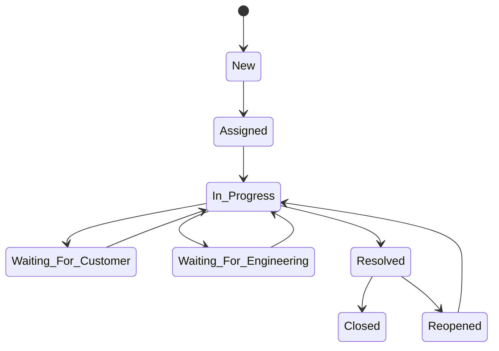
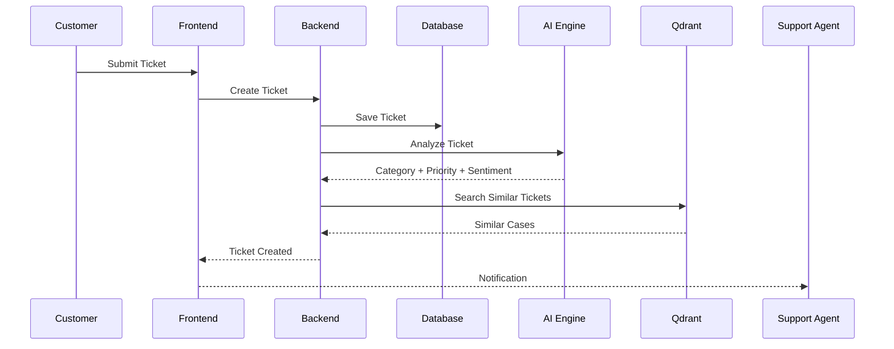

# Module 3 – Ticket Management

## 3.1 Business Problem

Enterprise customer support teams receive hundreds or thousands of support requests daily through multiple communication channels. Traditional ticketing systems primarily focus on recording and tracking tickets but provide limited intelligence for prioritization, issue resolution, and knowledge reuse.

Support engineers often spend significant time investigating issues that have already been solved previously. Duplicate investigations, inconsistent categorization, delayed prioritization, and lack of centralized organizational knowledge increase operational costs and negatively impact customer satisfaction.

CaseMind addresses these challenges by introducing AI-powered ticket intelligence that transforms traditional ticket management into an intelligent decision-support system.

---

## 3.2 Business Objectives

The Ticket Management module aims to achieve the following objectives:

- Provide centralized management of customer support tickets.
- Reduce ticket resolution time.
- Improve ticket prioritization.
- Detect duplicate issues automatically.
- Recommend proven historical resolutions.
- Improve collaboration between support and engineering teams.
- Preserve organizational knowledge.
- Enable data-driven support operations.

---

## 3.3 Module Scope

This module is responsible for the complete lifecycle of customer support tickets from creation to closure.

The scope includes:

- Ticket Creation
- Ticket Assignment
- Ticket Categorization
- Ticket Prioritization
- Ticket Status Management
- Ticket Comments
- File Attachments
- AI Analysis
- Resolution Recording
- Ticket Closure
- Ticket Reopening
- Ticket Search
- Ticket Filtering
- Ticket Analytics

---

## 3.4 Actors

Primary Actors

- Support Agent
- Support Manager

Secondary Actors

- Engineering Team
- Product Manager
- Customer Success Team
- System Administrator

System Actors

- AI Classification Engine
- Priority Prediction Model
- Duplicate Detection Engine
- Organizational Memory Engine
- Notification Service

---

## 3.5 Ticket Lifecycle

Every ticket progresses through a predefined lifecycle.

The supported states are:

- New
- Assigned
- In Progress
- Waiting for Customer
- Waiting for Engineering
- Resolved
- Closed
- Reopened

The system shall maintain a complete history of every state transition.

---

## 3.6 Business Value

The Ticket Management module provides value by:

- Reducing manual effort.
- Improving operational visibility.
- Standardizing support workflows.
- Increasing first-contact resolution.
- Preserving engineering knowledge.
- Supporting AI-driven automation.
- Enabling analytics and reporting.

---

## 3.7 Success Metrics

The success of this module shall be measured using:

- Average Resolution Time
- Average First Response Time
- Ticket Reopen Rate
- Duplicate Ticket Reduction
- First Contact Resolution Rate
- SLA Compliance
- AI Recommendation Acceptance Rate
- Customer Satisfaction Score (CSAT)

## 3.8 Ticket Lifecycle Diagram

## 3.9 High-Level Ticket Workflow

## 3.10 Sequence Diagram

